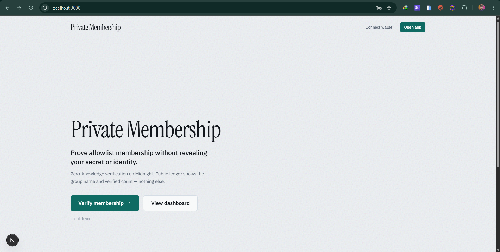
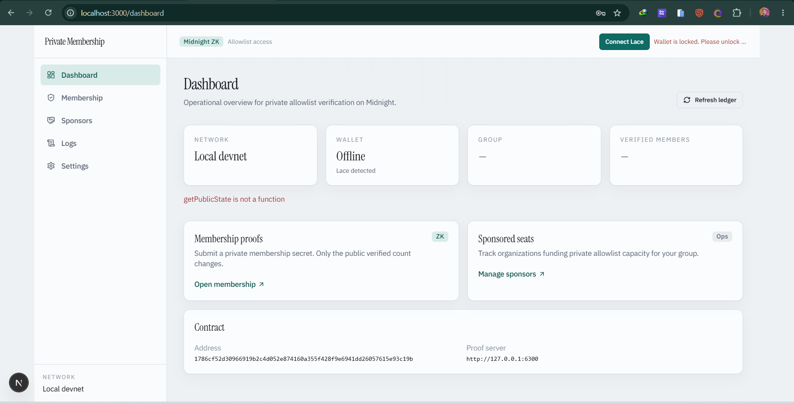
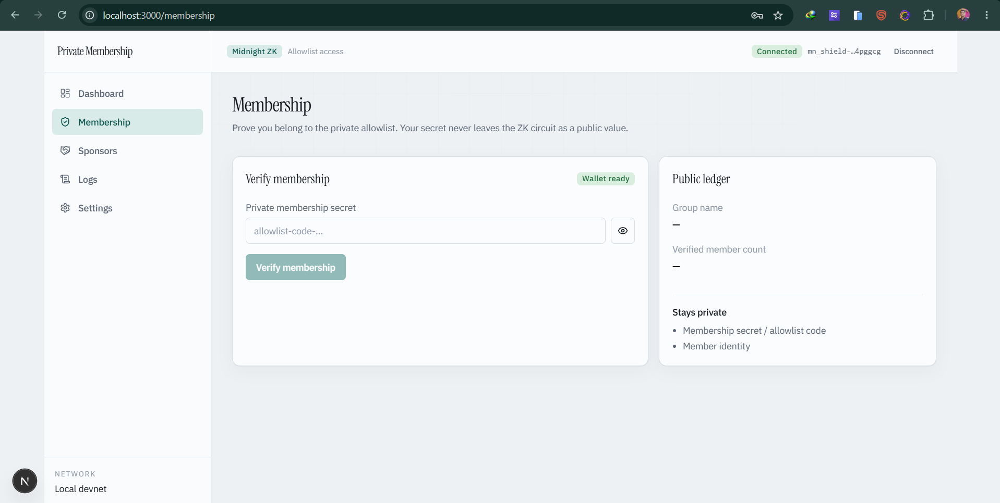
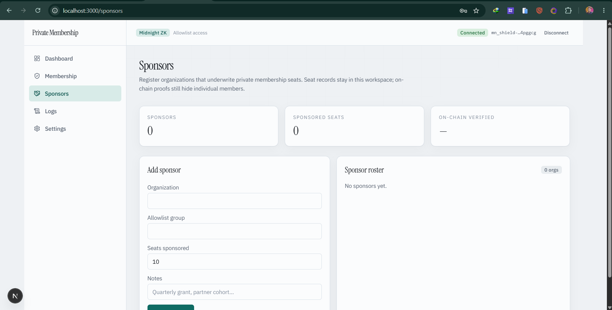
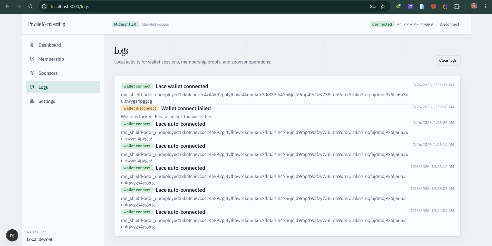
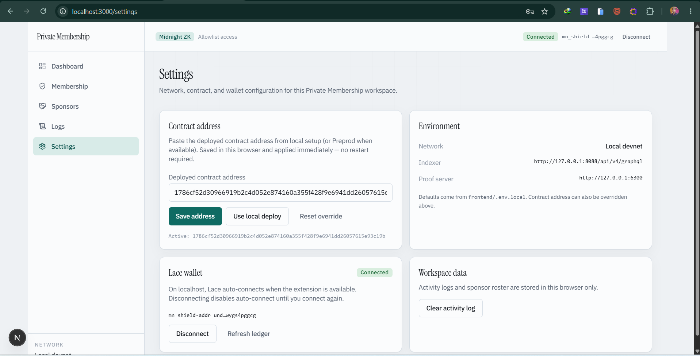

# Private Membership Verification
> A privacy-preserving zero-knowledge allowlist membership dApp on the Midnight Network — prove you belong without revealing your secret or identity.

[](https://private-membership-verification.vercel.app/)
[](https://youtu.be/REPLACE_WITH_YOUR_VIDEO_ID)
[](https://github.com/saikat-tanti/private-membership-verification/actions/workflows/ci.yml)
[](https://midnight.network)
[](https://docs.midnight.network)
[](https://nodejs.org)
[](LICENSE)

---

## Live Demo, Video & Repository
- **Live Web Application**: [https://private-membership-verification.vercel.app/](https://private-membership-verification.vercel.app/) *(update URL after your Vercel deploy)*
- **YouTube Demo Video**: [https://youtu.be/REPLACE_WITH_YOUR_VIDEO_ID](https://youtu.be/REPLACE_WITH_YOUR_VIDEO_ID) *(paste your upload link)*
- **GitHub Repository**: [https://github.com/saikat-tanti/private-membership-verification](https://github.com/saikat-tanti/private-membership-verification)
- **CI/CD Workflow**: [`.github/workflows/ci.yml`](.github/workflows/ci.yml)

---

## Challenge Requirements & Passing Checklist
- [x] **Fully Functional Privacy dApp**: Midnight ZK allowlist — private `membershipSecret`, public `groupName` + `verifiedMemberCount`
- [x] **Live Demo Deployment**: Vercel-ready Next.js 16 app (`frontend/`)
- [x] **Demo Video (Lace Wallet + Membership UI)**: Lace connect + Membership / Dashboard / Settings walkthrough
- [x] **Passing Test Suite**: 15 Node test cases (`npm test`)
- [x] **CI/CD Pipeline Running**: GitHub Actions — Compact compile, tests, Next.js build
- [x] **Public GitHub Repository**: [saikat-tanti/private-membership-verification](https://github.com/saikat-tanti/private-membership-verification)
- [x] **Deployed Smart Contract (local undeployed)**: `1786cf52d30966919b2c4d052e874160a355f428f9e6941dd26057615e93c19b`
- [x] **Browser Wallet Integration**: Lace via `window.midnight` enumeration (`connect` / legacy `enable`)
- [x] **Lace Wallet Connect / Disconnect Lifecycle**: Auto-connect on localhost + Settings session controls
- [x] **16+ Meaningful Commits**: Structured history on `main`
- [x] **Preprod status documented**: Wallet sync blocked; mentor guidance followed (full-stack first)

---

## Product Idea — Private Allowlist Access

Exclusive DAOs, gated communities, and private cohorts need members to prove entitlement. Traditional flows force users to expose wallet identity or allowlist secrets on-chain.

**Private Membership Verification** lets a member prove knowledge of a private membership secret. The Midnight ledger only learns the **group name** and the **aggregate verified-member count**.

| Audience | Value |
| --- | --- |
| DAO / allowlist operators | Public growth signal without doxxing members |
| Members | Prove belonging without revealing the secret or identity |
| Sponsors | Track sponsored seats off-chain while proofs stay private |

---

## Midnight Privacy Model

### What an observer CANNOT learn
1. **Membership secret / allowlist code** — private `Opaque<"string">` circuit input; never `disclose()`’d
2. **Member identity / who verified** — not written to the public ledger
3. **Wallet ↔ secret linkage** — observers see a valid verification event, not the witness

### What an observer CAN learn
1. **Group name** (`groupName`) — disclosed at deploy
2. **Verified member count** (`verifiedMemberCount`) — increments on successful `verifyMembership`
3. **That a valid ZK verification occurred**

---

## Contract & Deployment Details

| Environment | Location / Address | Notes |
| --- | --- | --- |
| **Live Web App** | `https://private-membership-verification.vercel.app/` | Update after Vercel deploy |
| **Demo Video** | YouTube link (replace placeholder) | Lace + Membership UI |
| **Local undeployed contract** | `1786cf52d30966919b2c4d052e874160a355f428f9e6941dd26057615e93c19b` | Group: **VIP Founders Club** |
| **CI/CD** | [GitHub Actions](https://github.com/saikat-tanti/private-membership-verification/actions) | Compact + tests + Next build |
| **Preprod** | Attempted — blocked | See `preprod-attempt.log` + mentor note below |

### Preprod / mentor note
> If you're unable to deploy, just build the full-stack dApp and submit it. Skip the deployment part for now.

Preprod wallet sync timed out (`Wallet.Sync`). Local undeployed deploy succeeded; full-stack app + CI are submitted with Preprod documented as pending.

---

## App Routes

| Route | Purpose |
| --- | --- |
| `/` | Brand landing |
| `/dashboard` | Network, wallet, group, verified count |
| `/membership` | Private secret → `verifyMembership` + public ledger |
| `/sponsors` | Sponsor seat roster for the allowlist |
| `/logs` | Local activity (wallet / verify / sponsors) |
| `/settings` | Contract address, Lace, env |

---

## Lace Wallet Connector

```typescript
// Enumerate window.midnight (UUID keys). Prefer Lace; support connect(network) + enable().
const wallets = Object.values(window.midnight ?? {}).filter(looksLikeWallet);
const lace = wallets.find((w) => `${w.name ?? ''} ${w.rdns ?? ''}`.toLowerCase().includes('lace'));
const connected = await (lace ?? wallets[0]).connect('undeployed'); // or enable() on legacy API
```

On localhost the app **auto-connects** Lace when present. Disconnecting disables auto-connect until you connect again (Settings).

---

## Quickstart & Local Installation

### Requirements
- Node.js **22+**
- Compact compiler **0.31.1** (`COMPACT_BACKEND=wasm` recommended)
- Docker (local proof server / undeployed stack)

```bash
git clone https://github.com/saikat-tanti/private-membership-verification.git
cd private-membership-verification
npm install
npm run frontend:install

# Compile Compact contract
export COMPACT_BACKEND=wasm   # Windows PowerShell: $env:COMPACT_BACKEND="wasm"
npm run compile

# Local stack + deploy (Docker required)
npm run setup -- --network undeployed

# Frontend
cp frontend/.env.example frontend/.env.local
npm run dev
```

Open [http://localhost:3000](http://localhost:3000).

### Frontend env (`frontend/.env.local`)
```env
VITE_NETWORK=undeployed
VITE_CONTRACT_ADDRESS=1786cf52d30966919b2c4d052e874160a355f428f9e6941dd26057615e93c19b
VITE_PROOF_SERVER_URL=http://localhost:6300
VITE_INDEXER_URI=http://127.0.0.1:8088/api/v4/graphql
VITE_INDEXER_WS_URI=ws://127.0.0.1:8088/api/v4/graphql/ws
```

Or paste the address in **Settings → Use local deploy** (no restart).

### Useful scripts
| Command | Purpose |
| --- | --- |
| `npm run compile` | Compile Compact contract |
| `npm test` | Contract / privacy / network tests |
| `npm run setup -- --network undeployed` | Docker stack + deploy |
| `npm run cli` / `npm run demo:verify` | Membership proof helpers |
| `npm run dev` | Next.js app (port 3000) |
| `npm run build` | Production build |

---

## Automated Test Suite

```bash
npm test
```

Expected (summary):
```text
ℹ tests 15
ℹ pass 15
ℹ fail 0
```

---

## Deploy to Vercel

1. Import [saikat-tanti/private-membership-verification](https://github.com/saikat-tanti/private-membership-verification) in [Vercel](https://vercel.com/new).
2. Set **Root Directory** to `frontend`.
3. Framework preset: **Next.js** (uses `frontend/vercel.json`).
4. Add environment variables:

| Name | Example value |
| --- | --- |
| `VITE_NETWORK` | `undeployed` |
| `VITE_CONTRACT_ADDRESS` | `1786cf52d30966919b2c4d052e874160a355f428f9e6941dd26057615e93c19b` |
| `VITE_PROOF_SERVER_URL` | your proof server URL (or leave for Lace/local demos) |
| `VITE_INDEXER_URI` | indexer GraphQL HTTP (optional on static UI demos) |
| `VITE_INDEXER_WS_URI` | indexer GraphQL WS (optional) |

5. Deploy → copy the production URL into the badges / Live Demo section above.

CLI alternative (from repo root):
```bash
cd frontend
npx vercel
# Production:
npx vercel --prod
```

> Lace ZK submit against **local undeployed** needs your Docker stack. The Vercel UI still demonstrates landing, dashboard, Lace connect, membership form, sponsors, logs, and settings.

---

## Platform Screenshots

### Landing


### Dashboard


### Membership verification


### Sponsors


### Activity logs


### Settings (contract + Lace)


---

## License
MIT — see [LICENSE](LICENSE). Built for the Midnight Network community.
