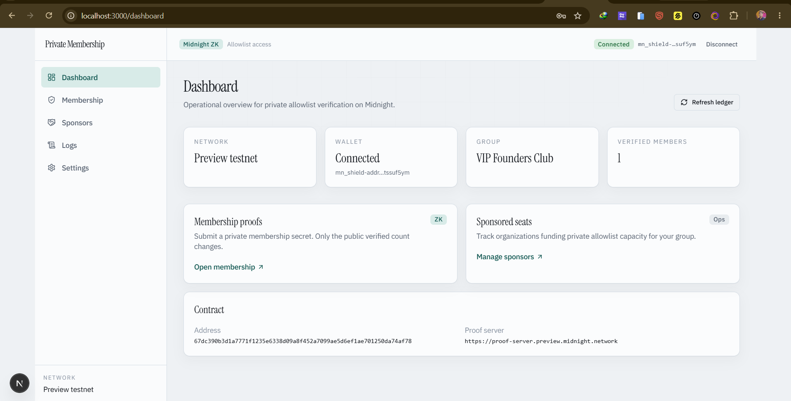

# Private Membership Verification

> Privacy-preserving zero-knowledge allowlist membership on the Midnight Network — prove you belong without revealing your secret or identity.

[](https://private-membership-verification.vercel.app/)
[](https://youtu.be/gnPuRBhZtxc)
[](https://github.com/saikat-tanti/private-membership-verification/actions/workflows/ci.yml)
[](https://docs.midnight.network)
[](https://nodejs.org)
[](LICENSE)

---

## Links

| Resource | URL |
| --- | --- |
| **Live demo** | [https://private-membership-verification.vercel.app/](https://private-membership-verification.vercel.app/) |
| **Demo video** | [https://youtu.be/gnPuRBhZtxc](https://youtu.be/gnPuRBhZtxc) |
| **GitHub** | [saikat-tanti/private-membership-verification](https://github.com/saikat-tanti/private-membership-verification) |
| **CI/CD** | [`.github/workflows/ci.yml`](.github/workflows/ci.yml) |
| **Proposal** | [PROPOSAL.md](PROPOSAL.md) |
| **Local contract** | `1786cf52d30966919b2c4d052e874160a355f428f9e6941dd26057615e93c19b` (VIP Founders Club) |
| **Preprod address (local)** | `1786cf52d30966919b2c4d052e874160a355f428f9e6941dd26057615e93c19b` |

CI installs Compact **0.31.1**, runs `npm run compile`, `npm test`, and builds the Next.js frontend.

---

## Challenge checklist

- [x] Privacy dApp with private `membershipSecret` and public `groupName` + `verifiedMemberCount`
- [x] Live demo on Vercel
- [x] Lace wallet connect / disconnect + status UI
- [x] 15/15 tests passing (`npm test`)
- [x] CI: Compact compile + tests + frontend build
- [x] Local undeployed contract deployed and documented
- [x] Preprod blocked/waived per mentor guidance (full-stack submitted first)
- [x] Meaningful commit history on `main`

---

## Product proposal — Private Allowlist Access

**Official category:** Private Allowlist Access

DAOs and gated communities often force members to reveal wallets or secrets on-chain. This dApp lets a member prove knowledge of a private membership secret while the public ledger only shows the **group name** and **verified member count**.

| Audience | Value |
| --- | --- |
| Allowlist operators | Public growth signal without doxxing members |
| Members | Prove belonging without revealing the secret |
| Sponsors | Track sponsored seats off-chain; proofs stay private |

---

## Privacy model

### Observers cannot learn
1. Membership secret / allowlist code (`Opaque<"string">` — never `disclose()`’d)
2. Who verified (identity not on the public ledger)
3. Wallet ↔ secret linkage

### Observers can learn
1. `groupName` (constructor `disclose()`)
2. `verifiedMemberCount` (increments on `verifyMembership`)
3. That a valid ZK verification occurred

---

## Contract & networks

| Environment | Detail |
| --- | --- |
| Live UI | [private-membership-verification.vercel.app](https://private-membership-verification.vercel.app/) |
| Demo video | [YouTube](https://youtu.be/gnPuRBhZtxc) |
| Local undeployed | `1786cf52d30966919b2c4d052e874160a355f428f9e6941dd26057615e93c19b` |
| Preprod address (local) | `1786cf52d30966919b2c4d052e874160a355f428f9e6941dd26057615e93c19b` |

### Mentor guidance (Preprod)

> If you're unable to deploy, just build the full-stack dApp and submit it. Skip the deployment part for now.

Preprod wallet sync timed out (`Wallet.Sync`) before deploy completed. Submission includes local undeployed deploy, live full-stack UI, tests, and CI.

### Switch to Preprod later

```env
VITE_NETWORK=preprod
VITE_CONTRACT_ADDRESS=<preprod-contract-address>
VITE_PROOF_SERVER_URL=https://proof-server.preprod.midnight.network
```

Or paste the address in **Settings** and connect Lace on Preprod.

---

## App routes

| Route | Purpose |
| --- | --- |
| `/` | Landing |
| `/dashboard` | Network, wallet, group, verified count |
| `/membership` | Private secret → `verifyMembership` + public ledger |
| `/sponsors` | Sponsor seat roster |
| `/logs` | Local activity log |
| `/settings` | Contract address, Lace, env |

---

## Quickstart

**Requirements:** Node.js 22+, Midnight Compact (compiler **0.31.1**), Docker for local stack. Prefer **Ubuntu WSL** for Compact — on Windows, `compact` may resolve to the OS compression tool; use `~/.local/bin/compact`.

```bash
git clone https://github.com/saikat-tanti/private-membership-verification.git
cd private-membership-verification
npm install && npm install

export COMPACT_BACKEND=wasm   # PowerShell: $env:COMPACT_BACKEND="wasm"
npm run compile
npm run setup -- --network undeployed

cp membership-ui/.env.example membership-ui/.env.local
npm run dev
```

Open [http://localhost:3000](http://localhost:3000) or the [live demo](https://private-membership-verification.vercel.app/).

### Env (`membership-ui/.env.local`)

```env
VITE_NETWORK=undeployed
VITE_CONTRACT_ADDRESS=1786cf52d30966919b2c4d052e874160a355f428f9e6941dd26057615e93c19b
VITE_PROOF_SERVER_URL=http://localhost:6300
VITE_INDEXER_URI=http://127.0.0.1:8088/api/v4/graphql
VITE_INDEXER_WS_URI=ws://127.0.0.1:8088/api/v4/graphql/ws
```

### Scripts

| Command | Purpose |
| --- | --- |
| `npm run compile` | Compact → `contract/src/managed/` |
| `npm test` | 15 contract / privacy / network tests |
| `npm run setup -- --network undeployed` | Docker + local deploy |
| `npm run cli` / `npm run demo:verify` | Membership helpers |
| `npm run dev` | Next.js on port 3000 |
| `npm run build` | Production build |

### Tests

```bash
npm test
# ℹ tests 15 · pass 15 · fail 0
```

---

## Level 1 / 2 / 3

### Level 1 — New Moon
- [x] Compact 0.31.1 toolchain documented
- [x] Contract: `contract/src/private-membership-verification.compact`
- [x] Public: `groupName`, `verifiedMemberCount`
- [x] Private: `membershipSecret`
- [x] `disclose()` only for `groupName`
- [x] Managed artifacts generated
- [x] Local undeployed address documented
- [x] Product idea + privacy in README
- [x] Preprod waived per mentor
- [x] ≥5 meaningful commits

### Level 2 — Waxing Crescent
- [x] Next.js 16 frontend live on Vercel
- [x] Lace connect / disconnect + status
- [x] Network + contract via env / Settings
- [x] UI wired to `verifyMembership`
- [x] Loading / success / error states
- [x] Public state panel
- [x] Local run + Preprod switch docs
- [x] ≥8 meaningful commits

### Level 3 — First Quarter
- [x] Category: **Private Allowlist Access**
- [x] ≥3 tests (15 passing)
- [x] CI: compile + test + frontend build
- [x] Privacy Model + Product Proposal + checklists
- [x] Polished multi-page UI
- [x] ≥10 meaningful commits
- [x] No secrets / seeds / `.midnight-state.json` in git

---

## Screenshots

### Landing


### Dashboard


### Membership


### Sponsors


### Logs


### Settings


---

## License

MIT — see [LICENSE](LICENSE). Built for the Midnight Network community.
